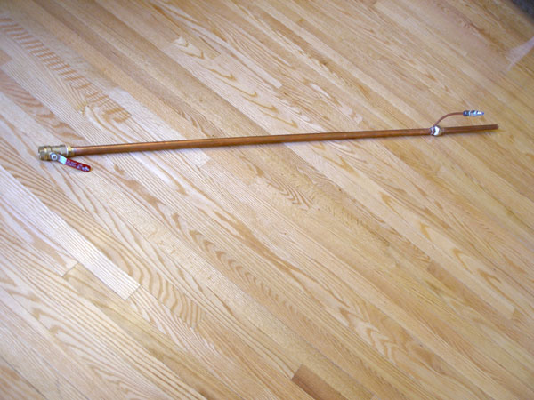

# Ranque-Hilsch Effect Tube

A simple Ranque-Hilsch effect (vortex) tube built largely from off-the-shelf plumbing parts.



The illustrated project site is available at the [Ranque-Hilsch webpage](https://pdbuchan.github.io/ranque-hilsch/) on GitHub Pages.

The site contains:

- an overview of the Ranque-Hilsch effect tube and the observed results;
- a photographed parts list;
- a step-by-step assembly page; and
- the original project photographs and diagram.

## Repository layout

```text
ranque-hilsch/
├── README.md
└── docs/
    ├── .nojekyll
    ├── index.html
    ├── parts.html
    ├── assembly.html
    └── assets/
        ├── ranque-hilsch.css
        └── images/
            └── *.jpg
```

## Project notes

The design was intentionally aimed at simplicity rather than efficiency. It uses ordinary plumbing components, soldered copper pipe, a small copper air-inlet tube, a washer as the cold-end orifice, a ball valve as the hot-end throttle, and compressed air.

The original test was qualitative: with compressor pressure near 100 psi, the long-end exhaust felt warmer than ambient air, while the short-end exhaust and nearby copper pipe felt substantially colder.

## References

1. Mark P. Silverman, *And Yet It Moves: Strange Systems and Subtle Questions in Physics*, Cambridge University Press, 1993.
2. R. Hilsch, “The Use of the Expansion of Gases in a Centrifugal Field as Cooling Process,” *The Review of Scientific Instruments*, vol. 18, no. 2, pp. 108–113, 1947.
